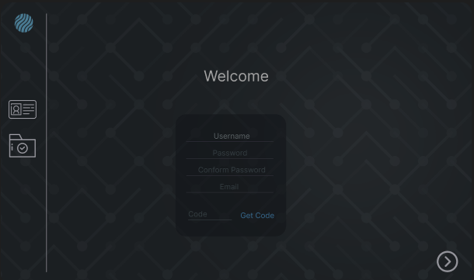
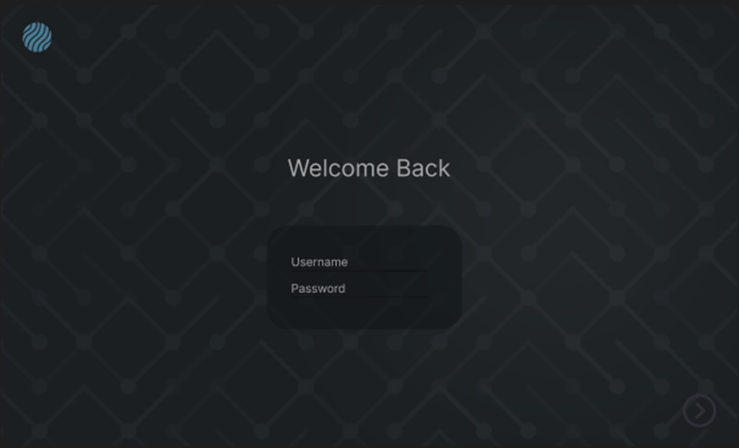
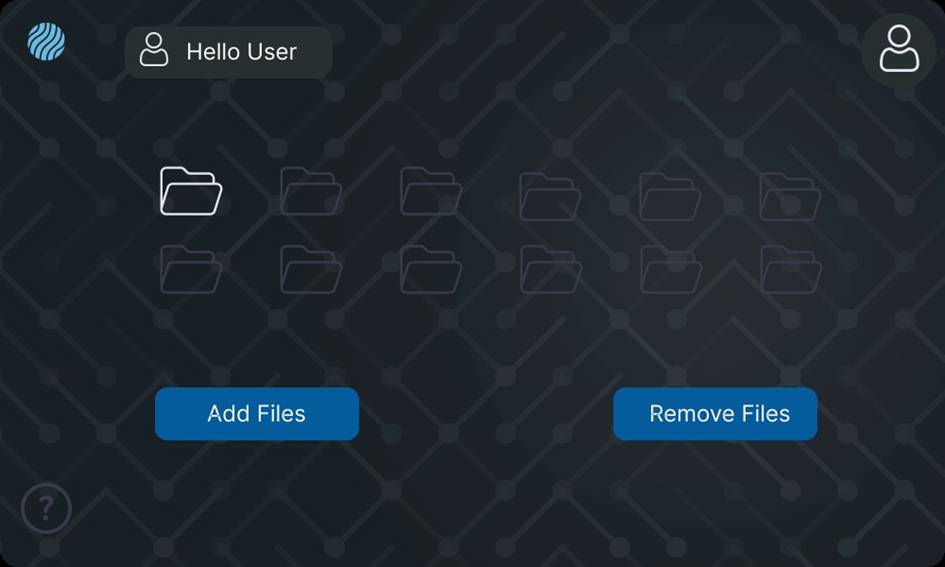
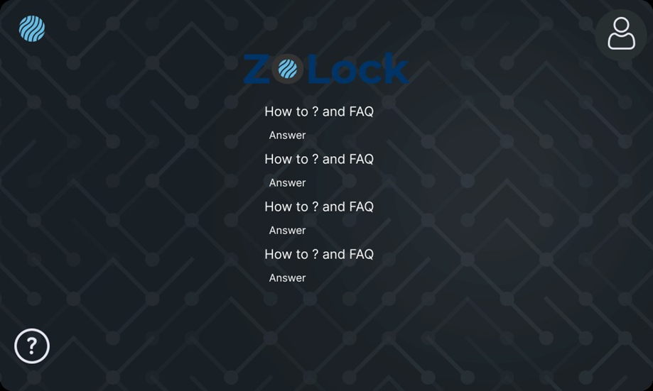

# OOP Final Project: Z0Key

## Introduction

Z0key is a secure file encryption desktop application that allows users to safely store sensitive personal files. Using AES-256 symmetric encryption tied to user accounts, it provides robust protection of user data.

The application has an intuitive graphical interface for easy file upload and management. For key handling and authentication, it integrates with a custom backend server and database solution built on ASP.NET Core and SQL Server.

## GUI

The client application uses Windows Presentation Foundation (WPF) for cross-platform support. It implements multiple windows for clean separation of registration, login, file management and help sections.

### Design

#### StartUp pages

These pages only come in the setup process, and they are never shown again. This is the GUI design I’m going for in the setup page:

- First, when the app is installed, the user is prompted with a setup window that asks for their username, password, confirm password, and email. After filling out these fields, they will receive a code in the email they provided. They will then need to enter this code for verification.
- Next, the user is prompted to drag and drop the files they need to encrypt. There is also a button for selecting the files from the device.
- Finally, there is a finish setup button to complete the process and start using the app.

#### Login Pages

The sign in pages would look like this:

- First, it will ask for the username and password. If the credentials are correct, the user will be granted access to the files that are encrypted.
- In the home tab, the user will see a hello user message and the date and time of their last login.
- At the bottom of the page, there are add files and remove files buttons, which allow the user to manage their files.
- There is also a help button on the bottom left corner of the page, which leads to a page with lots of how to and FAQ questions and answers.

## Functions

### User Registration

- - Collecting user credentials, including a username and password, for authentication. Implementing two-factor authentication by sending a verification code to the user's email for enhanced security. Storing user data (username, password, email, encryption key) securely in a server-side database rather than locally.

### File Selection and Encryption

- - Allowing users to choose files for encryption, ensuring compatibility with various file types and formats.

### Encryption Process

- - Utilizing a C# encryption algorithm to encrypt all selected files effectively.

### Secure Communication with Web Server

- - Employing secure communication protocols, such as HTTP, to transmit sensitive information like passwords and encryption keys to the server. Ensuring that server-side handling of this data is also securely managed.

### User Authentication

- - Implementing a robust and secure login process to verify user identity. This might involve secure hashing techniques and comparing stored password hashes for authentication.

### Decryption and Display

- - After successful user authentication, decrypting the files and presenting them to the user in a smooth and efficient manner.

## Implementation details

### User Registration and Login

When a user initiates the application for the first time, the initial steps involve setting up a username and password. Following this setup they receive a byte array containing the encryption program's key.

The user's key along with their data is then sent to a server using an HTTP POST request to the '/setuser' endpoint in the form of a JSON object:

{

“name”: “UserName”,

“password” : “Password”,

“email” : “UserEmail”

“key” : “EncryptionKey”

}

At the server end, upon receiving this request, the server adds the current time and stores this information in a database table that resembles the following structure:

| Name | Password | Email | Key | Last Modified |
| --- | --- | --- | --- | --- |
| Username | Password | UserEmail | EncryptionKey | DateTime Object |

Subsequently, when the user opens the app for subsequent access to files, a different HTTP POST request is made to validate the username and password. This validation request is sent to the '/verify' endpoint on the server side:

{

“name“ : “UserName”

“password” : “Password”

}

If the credentials provided are correct, the server retrieves the current time, updates the relevant column in the server's database, and responds by returning the encryption key as a JSON object:

{

“key” : “EncryptionKey”

“lastmodifiedtime”: “LastModifiedTime”

}

However, if the username or password is incorrect, the server responds with a JSON object lacking the key:

{

“key” : “null”

“lastmodifiedtime”: “null”

}

The change password API is handled by PostToChangeUserPasswordAsync() method. It takes in a ChangeUserPassword object containing username and new desired password.

This data is JSON serialized and posted to the cpwd endpoint using HttpClient.

Copy code

{

"name": "johnDoe",

"newpassword": "newS3curePass123"

}

The endpoint handler authenticates the user, verifies their identity, and updates the password securely in the database.

The PostToDeleteUserAsync() method calls the deleteuser API to remove a user account.

It serializes the username in the request:

Copy code

{

"name": "johnDoe"

}

After authentication and validation, the endpoint deletes the user data from database. Any associated encryption keys, files are also purged through cascading delete constraints.

This process outlines the secure user authentication and key verification mechanisms implemented between the client application and the server.

### Secure Server

The backend server application is built using ASP.NET Core and exposes REST API endpoints that are consumed by the Z0key client.

The server runs on IIS and utilizes the ASP.NET Core Data Protection stack for encryption/decryption. Keys used for this server-side cryptographic processing are securely stored and protected.

**Database**

For persisting user data and encryption keys, a SQL Server database named UserInfo is used. This database contains a table UserInfo defined with the necessary columns - UserName, Password, Email, Key, LastModifiedTime.

The database is hosted on a local SQL Server instance called DESKTOP-MINE\\TEW_SQLEXPRESS.

**Database Interaction**

The interactions with the SQL database are handled by the DatabaseService class which encapsulates all the data access logic.

It establishes a connection to the database server using ADO.NET SQLClient and handles typical CRUD operations through SQL commands.

On user creation, it inserts an entry into the UserInfo table. For authentication, it queries the table and verifies the username and password.

This centralized data access layer keeps the database implementation abstracted from other application layers.

### File Selection and Encryption

When launching the application for the first time, users are prompted to set up their account by providing a username, password, and email address. Subsequently, they are guided to select files for encryption using an OpenFileDialog. Once the user chooses the files, they are relocated to a designated 'Files' folder within the '\\bin\\Debug\\net6.0-windows' directory of the project. Upon clicking the 'Finish' button, the application prompts the user to restart.

In case a user forgets to upload a file, they can log in to the application, where a dashboard displays all selected files. Below this, there is an 'Add Files' button for adding more files and a 'Remove Files' button for removing files. Upon closing the program, the selected files are encrypted using the key got form the server.

### Encryption Process

The Z0key application implements AES-256 encryption for securing user files. This is handled by the AESEncryptor class which takes care of the encryption and decryption processes.

The AESEncryptor class contains the cryptographic key as a byte array named Key. This key is securely obtained from the server upon user authentication.

The main methods offered by the class are:

**EncryptFile()**

This method takes the file path as input and generates an encrypted version of the file with "\_encrypt" appended to the filename.

The encryption process flow is:

1. Open input file stream with FileStream
2. Initialize AES-256 algorithm
3. Set cryptographic key on AES object
4. Generate Initialization Vector (IV)
5. Write IV to output file stream
6. Create CryptoStream to encrypt data
7. Read input stream in chunks and write encrypted data to output stream
8. Close streams and delete original unencrypted file

**DecryptFile()**

This method takes the encrypted file path as input and regenerates the original decrypted file with "\_decrypt" appended to filename.

The decryption process flow is:

1. Open encrypted file stream
2. Extract IV from start of file
3. Initialize AES algorithm
4. Set cryptographic key and IV on AES object
5. Create decrypting CryptoStream
6. Read encrypted data and write decrypted data to new file stream
7. Close streams and delete encrypted file

By encapsulating the encryption/decryption logic into this AESEncryptor class, the main application code is abstracted from these cryptographic details.

### Secure Communication with Web Server

The Z0key application implements secure communication with a backend web server for user management and authentication via the ServerRequests helper class.

It utilizes HttpClient for HTTP-based communication with the web API hosted on localhost port 5091. Request and response data is serialized and parsed using System.Text.Json.

**User Registration**

The PostToCreateUserAsync() method handles new user creation. It serializes the username, password, email and encryption key into a JSON payload and POSTs it to the setuser API endpoint.

The API endpoint inserts the new user data and encryption key into the database for storage.

**User Authentication**

The PostToVerifyUserAsync() method attempts to authenticate users on login. It serializes credentials into a request body and POSTS it to the verify endpoint.

The API endpoint verifies the username and password against database records. On success, it returns the encryption key to allow decryption access. If unauthorized, it returns a 401 error.

**Additional Endpoints**

Some additional endpoints provided include:

- cpwd to allow changing user passwords
- deleteuser to delete user accounts

By centralizing the integration logic into the ServerRequests class, the client app is abstracted away from communication details with the web API.

### User Authentication

User authentication is handled by the UserServices class. This class inherits the ServerRequests class to facilitate communication with the backend server.

During user registration, the CheckUser() method validates the entered username, password, confirm password, and email address. It utilizes regex to verify email format and checks that passwords match.

The CreateUser() method calls the server endpoint to register new user details. It then encrypts any selected files using the AESEncryptor class.

For login, the VerifyUser() method makes an authentication request to the server by calling PostToVerifyUserAsync(). On valid credentials, it receives the encryption key for decryption.

### Decryption and Display

After successful user authentication, VerifyUser() decrypts encrypted files in the Files folder using the following process:

1. Get array of all encrypted files with Directory.GetFiles()
2. Iterate through each file
3. Call DecryptFile() method from AESEncryptor instance to regenerate original decrypted file

This allows the user to access their original data securely once logged into the application.

On closing the application, CloseApp() is called which re-encrypts all decrypted files in the file directory to lock access.

By separating authentication, encryption, storage, and communication duties into different classes, the application architecture stays modular and secured.
